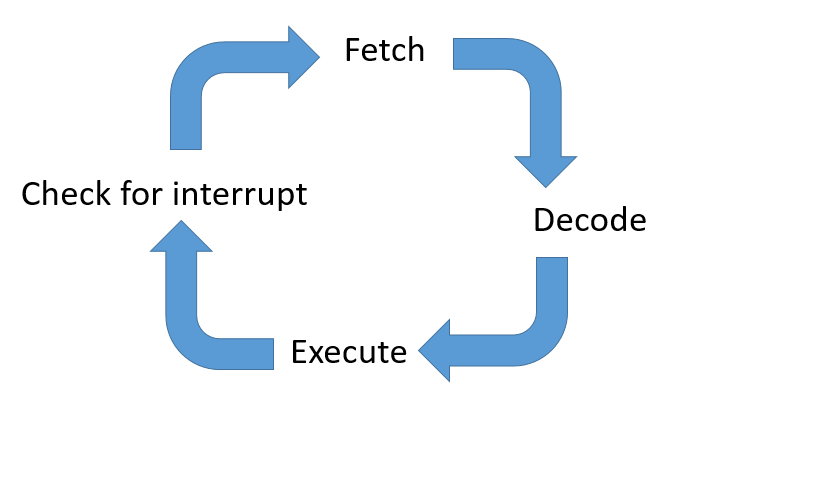

#Interrupts

>Describe the role of interrupts and interrupt
>service routines (ISRs); their effect on the FetchExecute
>cycle; and the need to save the volatile
>environment while the interrupt is being serviced.

**Interrupt**: An interrupt is an electrical signal (IRQ) generated by an event* outside the CPU.
It causes CPU to stop currently executing code and temporarily jump to a separate piece of code to deal with the event and return to what its doing before the interrupt has happened.

##ISR
An interrupt handler, also known as an interrupt service routine (ISR), is a callback subroutine in an operating system or device driver whose execution is triggered by the reception of an interrupt. 

Interrupt handlers have a multitude of functions, which vary based on the reason the interrupt was generated

Execution of ISR is referred to as **servicing of interrupt.**

### Servicing of Interrupt
1. ON receiving an interrupt, the first job of the OS is to save the state of the current process 
2. It does this by placing the contents of the registers, such as the PC and CIR onto the system stack
3. The OS then calls the routine required to handle the interrupt and the OS routes control to the appropriate Interrupt Handler
4. Once the interrupt has been processed, the CPU will retrieve the values from the stack and put them back in the appropriate registers, returning control to the program

##How Interrupt Affect Fetch-Execute Cycle

The interrupt happens after the cycle and before the new cycle takes place.

##Types of Interrupts
|Type of Interrupt| Role of Interrupt|Source|
|:---------------:|:----------------:|:-----|
|Hardware Interrupt | Interact with devices or peripherals | External|
|Software Interrupt | Usually to trigger special operating system tasks i.e switching between user | Internal|
|Program Generated Interrupt| To handle exceptions, to transfer control to the operating system. | Internal |

##Example of Interrupts
* a printer sends a request for more data to be sent to it
* the user presses a key or clicks a mouse button
* an item of hardware develops a fault
* The user sends a signal asking for a program to be terminated

##Steps for Interrupt Mechanism
1. Identify the Interrupt
2. Identify the source of the Interrupt
3. Disable lower prioritized interrupts
4. Save the volatile environment
5. Service the interrupt
6. Restore the volatile environment

###Saving the Volatile Environment
* When an interrupt occurs, the program counter and status flags are saved in a special location – system stack
* New program counter and status flags are loaded. The location may be determined by the type of interrupt 

